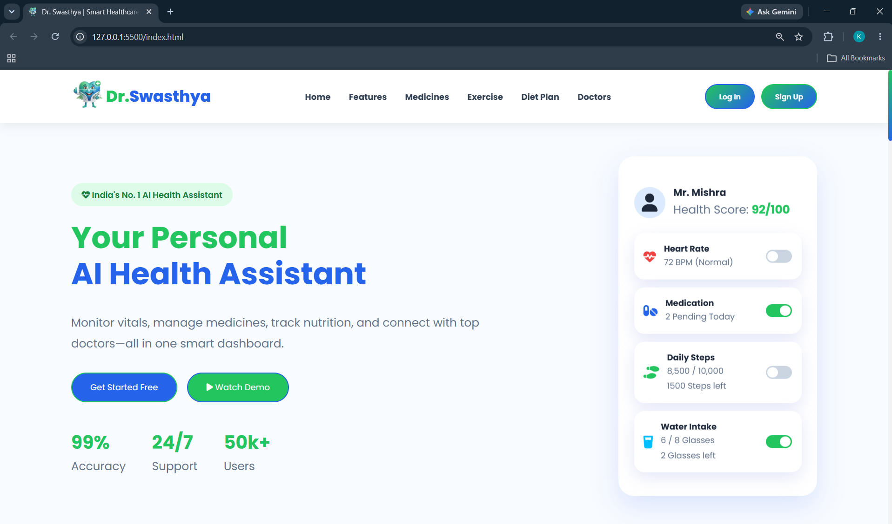
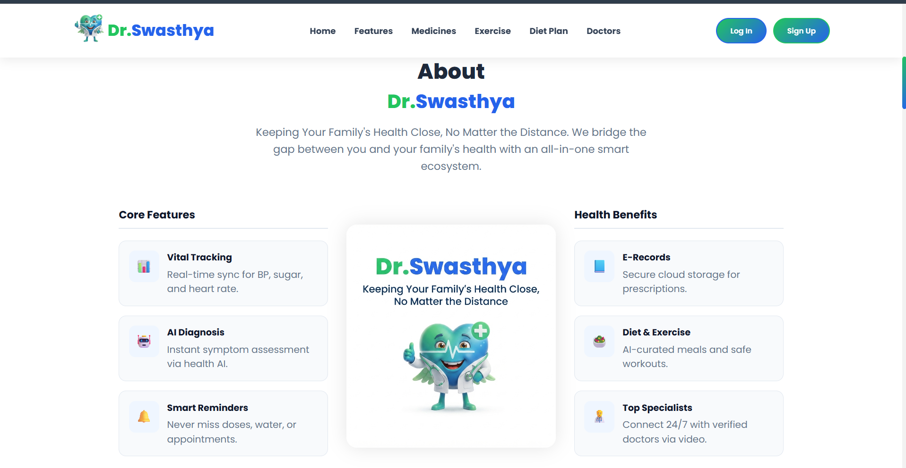
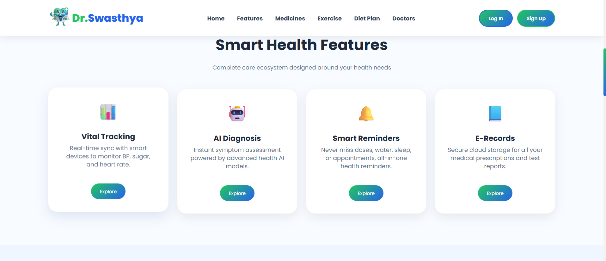
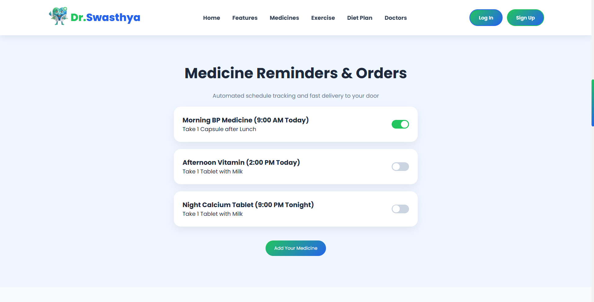
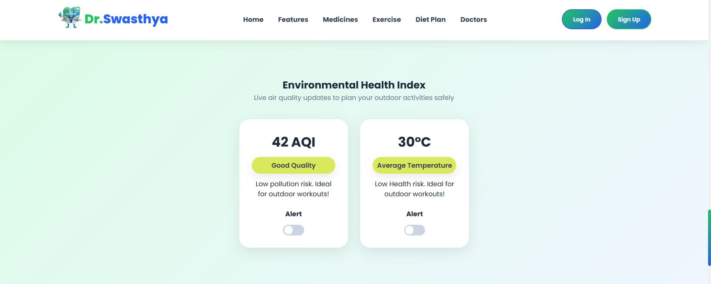
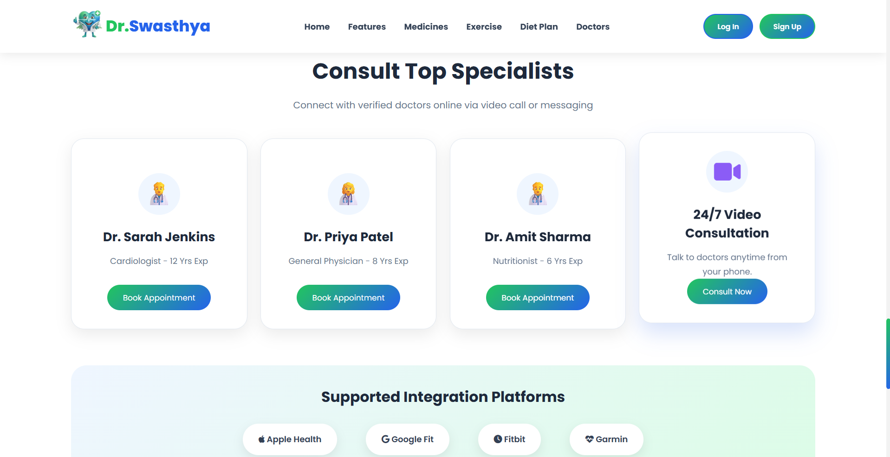
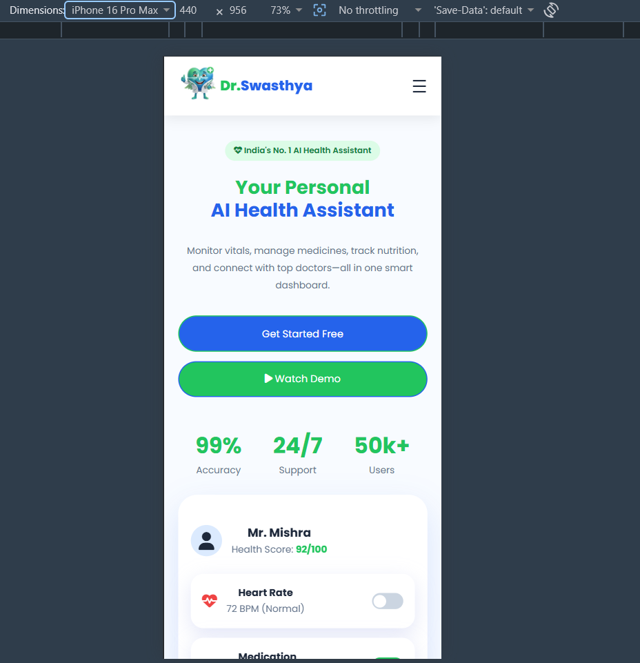
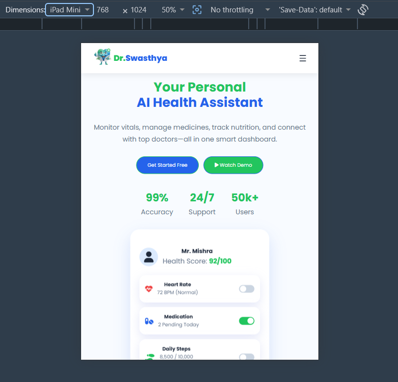

# OIBSIP
Web Development &amp; Designing Internship Projects | Oasis Infobyte

# 👨‍⚕️ Dr.Swasthya | Smart Healthcare Landing Page

A modern and responsive healthcare landing page designed to provide a simple and senior-friendly digital health experience.

Dr.Swasthya is a frontend project that brings health tracking, medicine reminders, exercise, diet planning, environmental health information, doctor consultation and family health protection into one clean interface.

> 📌 This project is created as a frontend landing page/demo using HTML and CSS.

---

## 🏠 Hero Section

### 📸 Project Preview


The landing page starts with a clean hero section introducing Dr.Swasthya as a smart healthcare companion.

It includes:

- Healthcare-focused branding
- Main call-to-action buttons
- Health statistics
- Smart health dashboard preview
- Responsive layout

---
## 👥 About Us

### 📸 Project Preview


The about section introduces the core vision of the platform with an engaging layout and a professional banner.

#### It includes
- **Dr. Swasthya** brand identity with a clean green and blue color palette.
- Mission statement: *"Keeping Your Family's Health Close, No Matter the Distance"*.
- Core features and health benefits preview columns in a 3-column layout.
- Balanced spacing and modern card designs with soft shadows.

---

## 💡 Smart Health Features


### 📸 Project Preview



The features section highlights the major healthcare services available in the interface.

- 📊 Vital Tracking
- 🤖 AI Diagnosis
- 🔔 Smart Reminders
- 📘 E-Records

Each feature is presented using a simple card-based layout.

---

## 💊 Medicine Reminders & Orders

### 📸 Project Preview


A dedicated medicine section helps users visualize their daily medicine schedule.

#### Features shown:

- Morning medicine reminder
- Afternoon medicine reminder
- Night medicine reminder
- Reminder toggle switches
- Add medicine button

---

## 🚶 Senior Friendly Exercise

The exercise section focuses on simple activities suitable for senior users.

#### Available exercise cards include:

- 🚶 Walking
- 🧘 Yoga
- 🤸 Stretching
- 🫁 Breathing Exercise

The section uses a simple card layout with clear actions and readable content.

---

## 🥗 Personalized Nutrition & Diet

A dedicated diet section presents a simple daily meal plan.

#### It includes:

- 🍳 Breakfast
- 🥗 Lunch
- 🍲 Dinner
- Calorie information
- Clean and easy-to-read cards

---

## 🌿 Environmental Health Index

### 📸 Project Preview


The environmental section provides a visual representation of health-related environmental information.

#### It includes:

- 🌫️ AQI information
- 🌡️ Temperature
- Health-related status indicators
- Alert toggle switches

This section is designed to show how environmental information can be presented alongside personal health information.

---

## 👨‍⚕️ Consult Top Specialists

### 📸 Project Preview


The doctor consultation section provides a simple interface for exploring healthcare specialists.

It includes:

- Doctor/specialist cards
- Consultation buttons
- Healthcare-focused visual design
- Responsive card layout

---

## 🔗 Supported Integration Platforms

The project also includes a section showcasing supported health platforms/integrations.

This helps demonstrate how the landing page can be extended to connect with different healthcare services and platforms.

---

## 👨‍👩‍👧 Family Health Protection

A dedicated family health section focuses on keeping family members connected with a simple and friendly call-to-action.

The section maintains the same visual language used throughout the website.

---
## 💬Testimonials

The testimonial section showcases real user experiences and feedback to build trust and credibility.

#### It includes:

- 👤 User profile avatars and names
- ⭐ Star rating indicators (e.g., 5-star ratings)
- 📝 Feedback cards highlighting ease of family health monitoring and doctor consultations
- 📐 Clean grid layout matching the overall website aesthetic

---

## 📱 Responsive Footer

### 📸 Project Preview


### 📸 Project Preview


The footer contains multiple navigation and information columns along with social and application-related elements.

It is designed to remain organized across different screen sizes.

---

### ✨ Key Features

- 🎨 Clean and modern healthcare UI
- 📱 Responsive design
- 👥 About Us
- 🧓 Senior-friendly interface
- 🧭 Sticky navigation bar
- 💊 Medicine reminder interface
- 🚶 Exercise section
- 🥗 Diet planning section
- 🌿 Environmental health section
- 👨‍⚕️ Doctor consultation section
- 👨‍👩‍👧 Family health section
- 💬 Testimonials
- 🔘 Interactive-looking toggle switches
- 🎯 Hover effects and smooth transitions
- 📜 Custom scrollbar
- 🔗 Smooth scrolling navigation
- 📐 Responsive layouts for desktop, tablet and mobile

---

## 🛠️ Technologies Used

### Frontend

- HTML5
- CSS3

### HTML Concepts Used

- Semantic HTML5 structure
- Headings and paragraphs
- Navigation links
- Lists
- Buttons
- Forms and input elements
- Images and image paths
- Sections and content organization
- Anchor links for smooth navigation
- Labels and input controls
- HTML attributes such as `class`, `id`, `href`, `src` and `alt`

### CSS Concepts Used

- CSS Variables
- Flexbox
- CSS Grid
- Media Queries
- CSS Animations
- Transitions
- Hover Effects
- Responsive Design
- Custom Scrollbar
- Sticky Navigation

### Development Tools

- Visual Studio Code
- Google Chrome
- Git & GitHub

---

## 📂 Project Structure

```text
Landiing Page/
│
├── Images/
│    
├── README.md
│
├── index.html
│   
│
└── style.css

