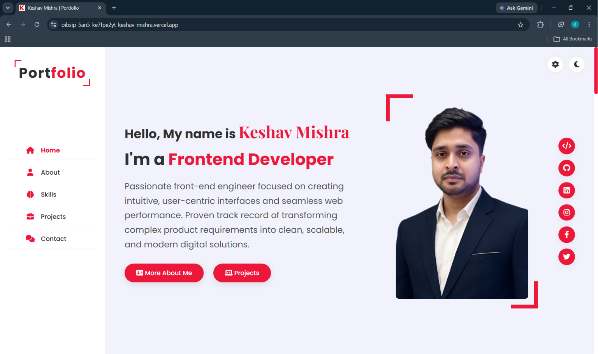
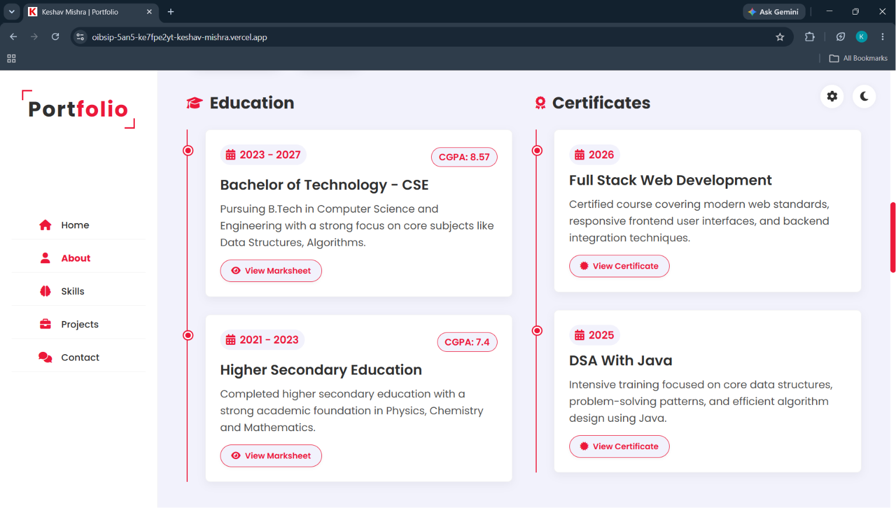
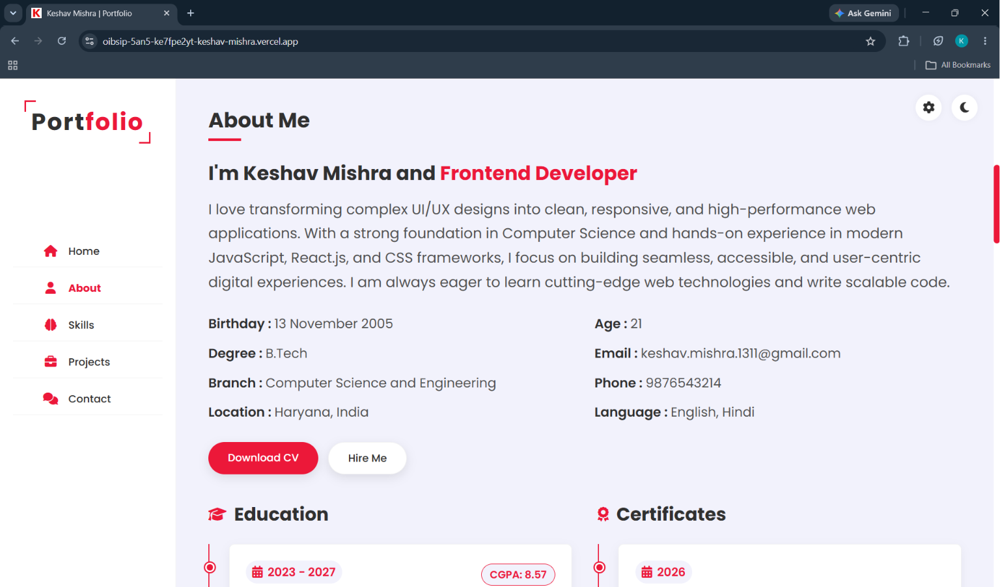
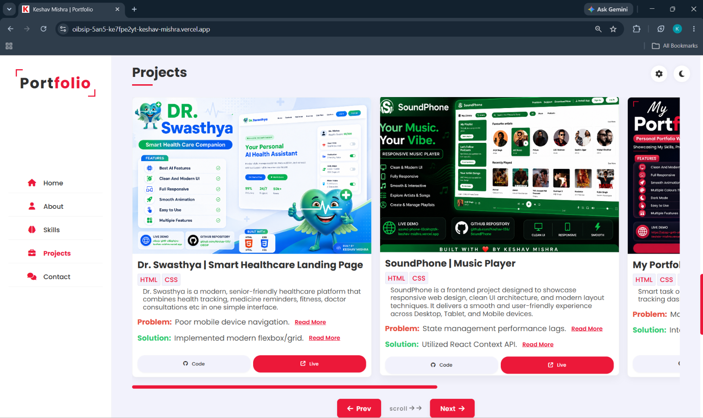
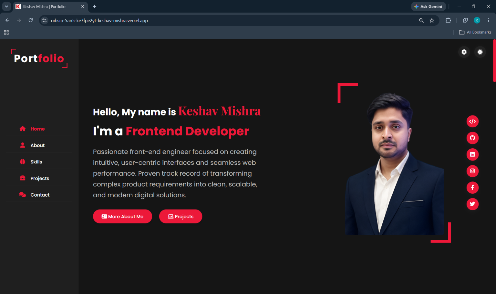
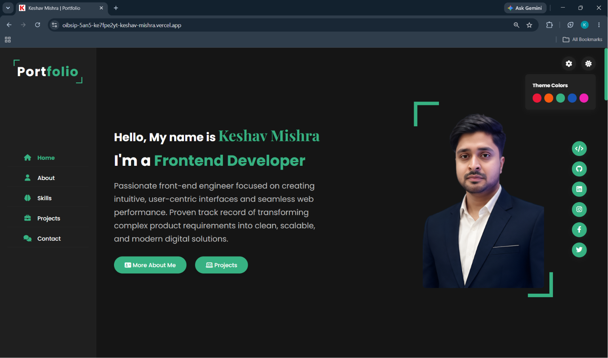
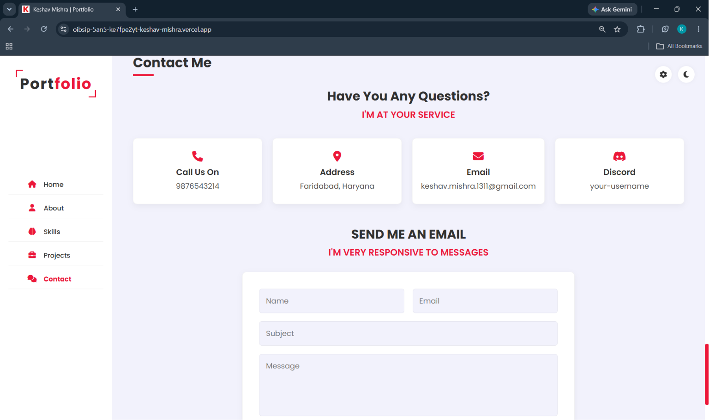
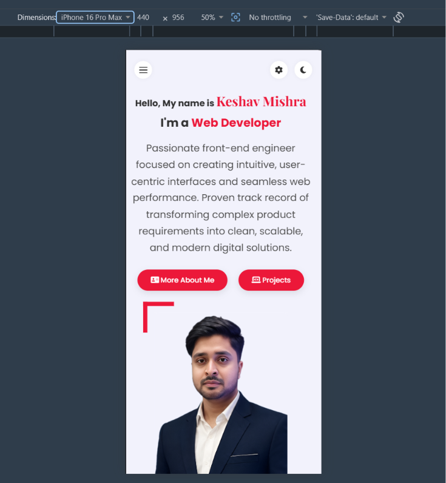

# 💼 Personal Portfolio

A modern, highly interactive, and fully responsive personal portfolio website designed to showcase my academic journey, technical skills, and projects as a Computer Science Engineering student.
This portfolio brings together my focus on Data Structures & Algorithms (Java), Frontend Development, and my aspirations to become an AI Engineer into one clean, professional interface.

📌 This project is created as a complete dynamic frontend web application using HTML, CSS, and Vanilla JavaScript.

## Live Demo
 [Click Here to View Live](https://oibsip-5an5-ircdafjwg-keshav-mishra.vercel.app)

---

## 🏠 Hero Section

### 📸 Project Preview


The landing page starts with a clean, professional hero section introducing me as a developer.
It includes:

- Dynamic typing effect ("Frontend Developer", "Web Developer")
- Professional branding and personal introduction
- Main call-to-action buttons (Download CV, Hire Me)
- Clean and fully responsive layout

## 👤 About Me

📸 _Project Preview_




The about section introduces my core vision, academic background, and career goals.
It includes:

- Clean layout detailing my B.Tech Computer Science background.
- Dedicated buttons for distinct professional details.
- Smooth scroll reveal animations triggered on scroll.

## 🛠️ Technical Skills

The skills section highlights my major technical competencies.

- 💻 Core Languages (Java, etc.)
- 🌐 Web Technologies (HTML, CSS, JS)
- 🧠 Data Structures & Algorithms
 Each skill area is presented using a simple card-based or progress-bar layout with modern styling.

## 📁 Project Showcase Carousel

📸 _Project Preview_


A dedicated interactive project section helps recruiters visualize my real-world work (including projects like Dr. Swasthya).
Features shown:

- Horizontal slider/carousel for easy navigation (Next/Prev buttons)
- "Read More" interactive buttons
- **Detailed Popups:** Clicking read more opens a dedicated popup showing in-depth "Problem" and "Solution" details for each project.
- Clean card designs with soft shadows and hover effects.

## 🎨 Theme & Customization Panel

The website includes a dynamic theme customization feature to demonstrate advanced JavaScript DOM manipulation.
It includes:

- 🌓 **Dark/Light Mode Toggle:** 
📸 _Project Preview_


Seamlessly switches the entire website's color scheme.

- 🎨 **Accent Color Switcher:** 
📸 _Project Preview_


Users can choose their preferred primary color (e.g., Blue, Green, Orange) from a settings panel, updating CSS variables globally.

## 📞 Contact & Feedback

📸 _Project Preview_


The contact section provides a simple, interactive form for recruiters and connections to reach out.
It includes:

- Input fields for Name, Email, and Message.
- **Success Modal:** Form submission triggers a sleek popup overlay confirming the message was sent.
- Responsive grid layout matching the overall website aesthetic.

## 📱 Responsive Footer

📸 _Project Preview_


The footer contains navigation links and social media connections (LinkedIn, GitHub, etc.).
It is designed to remain organized and easily accessible across all screen sizes.

---

## ✨ Key Features

- 🎨 Clean and modern professional UI
- 📱 100% Responsive design (Desktop, Tablet, Mobile)
- 🌓 Dark mode and Light mode support
- 🖌️ Dynamic Theme Color Switcher
- ⌨️ JavaScript Typing Text Effect
- 🎠 Interactive Project Slider
- 🗔 Custom Popups/Modals for Project Details & Contact Success
- 🧭 Sticky navigation bar with active section highlighting
- 🎯 Scroll reveal animations using Intersection Observer
- 📜 Custom scrollbar & smooth scrolling

---

## 🛠️ Technologies Used

### Core Frontend

- HTML5
- CSS3
- JavaScript (ES6+)

### HTML Concepts Used

- Semantic HTML5 structure (header, nav, section, aside, footer)
- Data attributes (`data-target`, `data-type`, `data-color`)
- Forms and input elements
- Interactive Modals and Overlays
- Anchor links for smooth navigation
- HTML attributes such as class, id, href, src, and alt

### CSS Concepts Used

- CSS Custom Properties (Variables) for Theme Switching
- Flexbox & CSS Grid for layouts
- Media Queries for responsiveness
- CSS Animations & Keyframes
- Smooth Transitions & Hover Effects
- Dark Mode specific styling
- Custom Scrollbar styling
- Sticky & Fixed Navigation

### JavaScript Concepts Used

- DOM Manipulation & Element Selection
- Event Listeners (click, scroll, submit, load)
- `IntersectionObserver` API for scroll animations
- Timers (`setTimeout`) for typing effects and intro screens
- Form Handling & Default Prevention
- Array iteration (`forEach`)

### Development Tools

- Visual Studio Code
- Google Chrome (DevTools)
- Git & GitHub

---

## 📂 Project Structure

```text
Portfolio/
│
├── Images/               # Profile pictures, project thumbnails, icons
│
├── README.md             # Project documentation
│
├── index.html            # Main HTML structure
│
├── style.css             # Main stylesheet with themes and media queries
│
└── script.js             # JavaScript logic (sliders, popups, theme, typing)