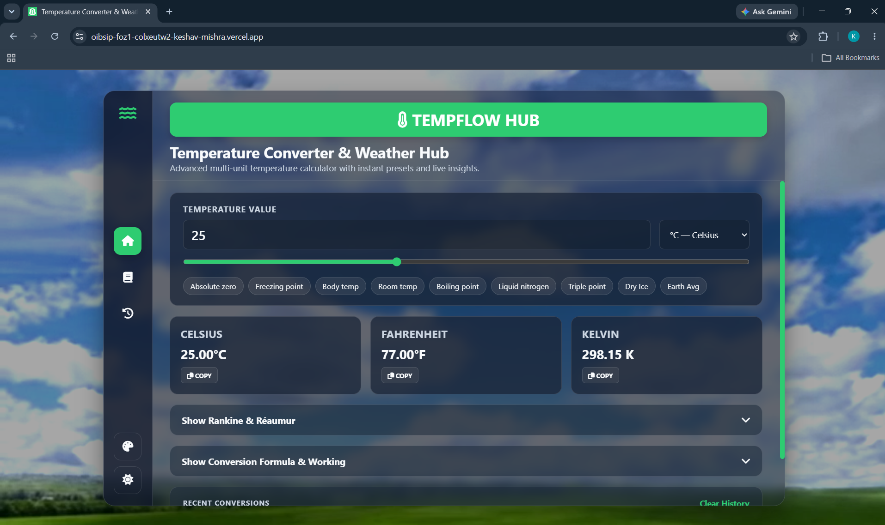
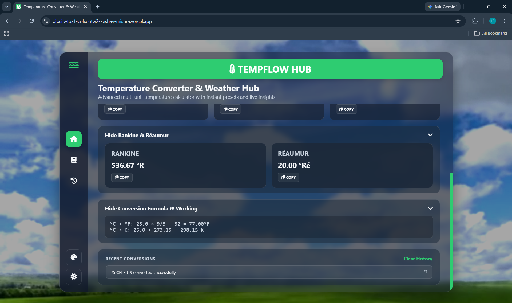
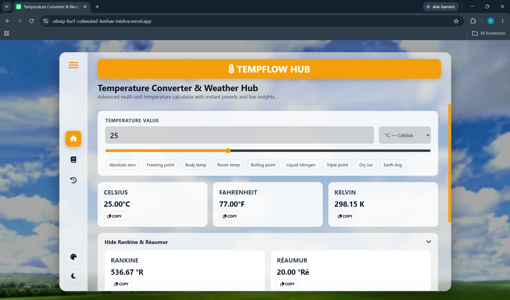
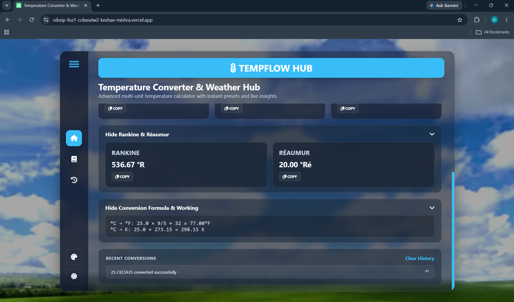
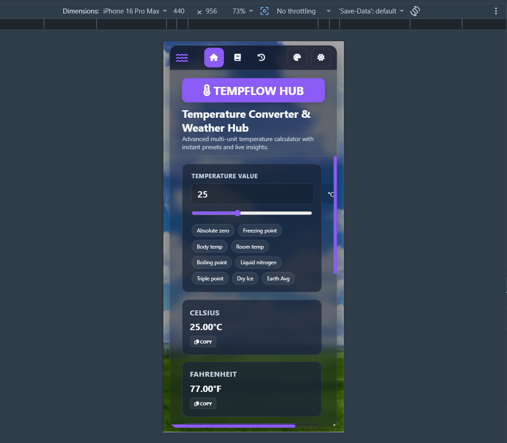
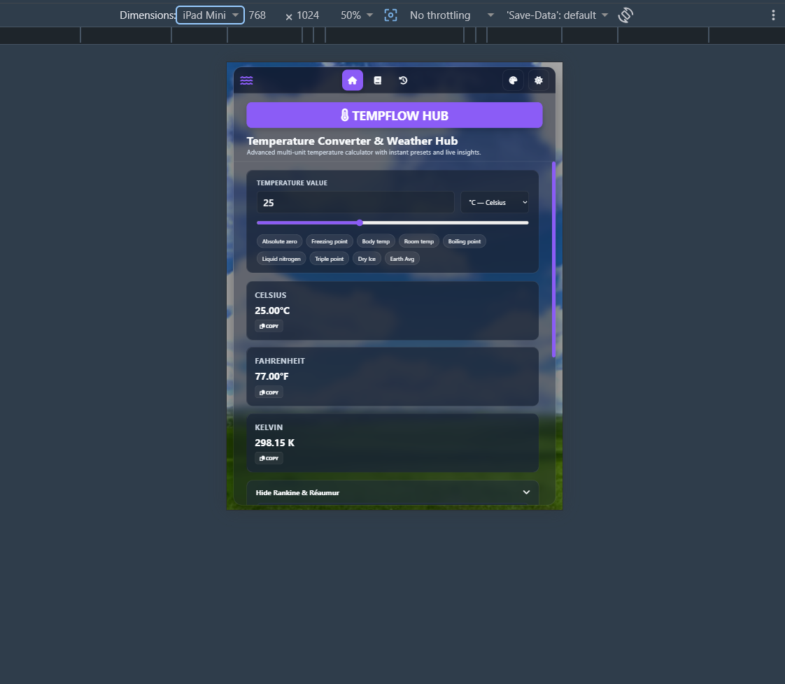

# 🌡️ TempFlow Hub | Temperature Converter Website

A modern and responsive temperature converter website built using HTML, CSS and JavaScript.

TempFlow Hub allows users to instantly convert temperatures between multiple units, view conversion formulas, use quick temperature presets and explore additional temperature scales through a clean dashboard interface.

> 📌 This project is created for the Oasis Infobyte Web Development & Designing Internship (Level 1).

---

## 🌐 Live Demo

- 🌐 [Click Here to View Live](https://oibsip-foz1-colxeutw2-keshav-mishra.vercel.app
) 
---

## 📸 Project Preview



### 🏠 Home Dashboard

A modern glassmorphism interface with a live temperature converter.

**Highlights**

- Multi-unit temperature conversion
- Responsive dashboard
- Instant value updates
- Clean dark UI
- Weather inspired design

---

### 🌡️ Temperature Converter

Convert temperatures instantly between major temperature scales.

**Supported Units**

- Celsius (°C)
- Fahrenheit (°F)
- Kelvin (K)

The converted values update automatically as the input changes.

---

### ⚡ Quick Temperature Presets


One-click preset buttons for commonly used temperatures.

**Available Presets**

- Absolute Zero
- Freezing Point
- Body Temperature
- Room Temperature
- Boiling Point
- Liquid Nitrogen
- Triple Point
- Dry Ice
- Earth Average

---

### 📊 Additional Temperature Scales

## 📸 Project Preview



The project also supports advanced temperature units.

- Rankine (°R)
- Réaumur (°Ré)

These values can be expanded or collapsed from the dashboard.

---

### 🧮 Conversion Formula & Working

Users can view the mathematical working behind every conversion.

Example:

- °C → °F
- °C → K

This makes the project useful for learning as well as calculation.

---

### 🚨 Smart Input Validation

TempFlow prevents invalid temperature values below **Absolute Zero (-273.15°C)**.

**Features**

- Alerts users for impossible temperature values
- Prevents invalid conversions
- Displays a clear warning message
- Improves calculation accuracy and user experience

---

### 🕘 Recent Conversion History

Every successful conversion is stored in a recent history section with the option to clear previous records.

---
### Dark/Light Mode

## 📸 Project Preview



---

### MultiColor Option

## 📸 Project Preview



---

### Responsive

## 📸 Project Preview



## 📸 Project Preview



---

## ✨ Key Features

- 🌡️ Multi-unit temperature conversion (Celsius, Fahrenheit, Kelvin, Rankine, Réaumur)
- ⚡ Instant real-time calculation & live interactive slider
- 🌓 Dark/Light mode toggle for custom visual comfort
- 🎨 Dynamic accent color theme switcher 
- 📱 Fully responsive design optimized for all devices
- 🧊 Modern glassmorphism UI with smooth hover effects
- 🔘 Quick temperature presets (Absolute zero, boiling point, room temp, etc.)
- 🧮 Step-by-step formula & working section
- 🚨 Smart input validation & absolute zero protection warning
- 📋 One-click copy converted values functionality
- 🕘 Recent conversion history tracker with clear options
- 📜 Custom scrollbar & clean, modern layout

---

## 🛠️ Technologies Used

### Frontend

- HTML5
- CSS3
- JavaScript (Vanilla, ES6)

### HTML Concepts

- Semantic HTML
- Forms & Input Fields
- Select Dropdown
- Buttons
- Sections
- Responsive Structure

### CSS Concepts

- CSS Variables
- Flexbox
- CSS Grid
- Glassmorphism UI
- Media Queries
- Animations
- Hover Effects
- Custom Scrollbar

### JavaScript Concepts

- DOM Manipulation
- Event Listeners
- Temperature Conversion Logic
- Dynamic UI Update
- Copy Functionality
- Recent History
- Preset Buttons

### Development Tools

- Visual Studio Code
- Google Chrome
- Git & GitHub

---

## 📂 Project Structure

```text
WebDev-L1-TemperatureConverter/
│
├── Images
├── index.html 
├── style.css 
├── script.js 
└── README.md
```

---

## 👨‍💻 Author

**Keshav Mishra**

B.Tech CSE | Frontend Developer

This project is created for educational purposes as part of the Oasis Infobyte Web Development & Designing Internship.